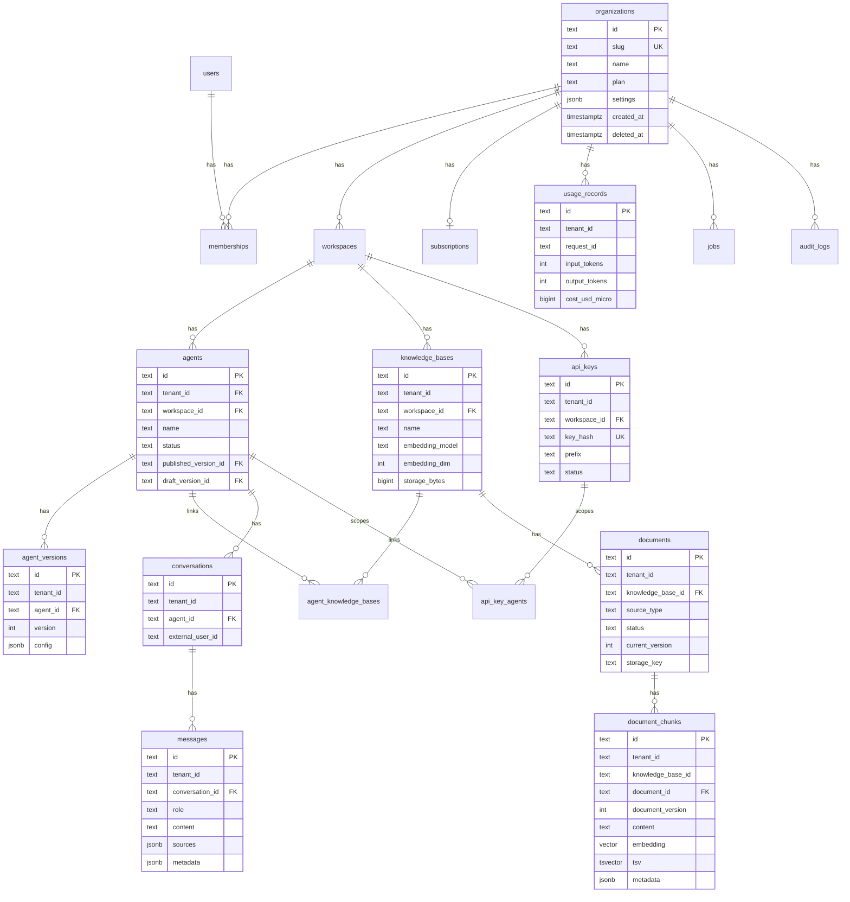

# 04 — Database ERD & Schema

Database: **PostgreSQL 16 + pgvector 0.7+** เดียว ใช้ทั้ง relational, vectors และ job queue (P1)
ID: **ULID** เก็บเป็น `TEXT` พร้อม prefix ที่ API layer (`org_`, `ws_`, `agt_`, `kb_`, `doc_`, `chk_`, `key_`, `conv_`, `msg_`, `req_`) เพื่ออ่านง่ายและ sort ตามเวลาได้ (ใน DB เก็บเฉพาะ ULID 26 ตัว, prefix เติมตอน serialize)

## 1. ERD



## 2. Conventions

- ทุกตารางที่เป็นข้อมูลลูกค้ามีคอลัมน์ `tenant_id TEXT NOT NULL` (= `organizations.id`) แม้จะ derive ได้จาก FK อื่น เพื่อให้ filter และ RLS ทำได้ตรง ๆ
- `created_at TIMESTAMPTZ NOT NULL DEFAULT now()`, `updated_at` ผ่าน trigger
- Soft delete ด้วย `deleted_at` สำหรับ organizations, agents, knowledge_bases, documents, api_keys; hard delete สำหรับ chunks (ผ่าน cleanup job)
- Enum เก็บเป็น `TEXT` + `CHECK` constraint (ง่ายต่อ migration กว่า PG enum)
- Money เก็บเป็น `BIGINT` micro-USD (`cost_usd_micro`) ไม่ใช้ float

## 3. DDL (migrations/0001_init.sql)

```sql
CREATE EXTENSION IF NOT EXISTS vector;
CREATE EXTENSION IF NOT EXISTS pgcrypto;
CREATE EXTENSION IF NOT EXISTS citext;

-- ===== Identity & Tenancy =====
CREATE TABLE users (
  id            TEXT PRIMARY KEY,
  email         CITEXT NOT NULL UNIQUE,
  password_hash TEXT,                      -- argon2id; NULL ถ้า magic-link only
  name          TEXT,
  email_verified_at TIMESTAMPTZ,
  created_at    TIMESTAMPTZ NOT NULL DEFAULT now(),
  updated_at    TIMESTAMPTZ NOT NULL DEFAULT now()
);

CREATE TABLE organizations (
  id          TEXT PRIMARY KEY,
  slug        TEXT NOT NULL UNIQUE,
  name        TEXT NOT NULL,
  plan        TEXT NOT NULL DEFAULT 'free' CHECK (plan IN ('free','starter','business','enterprise')),
  settings    JSONB NOT NULL DEFAULT '{}',   -- {default_language, allowed_model_policies,...}
  created_at  TIMESTAMPTZ NOT NULL DEFAULT now(),
  updated_at  TIMESTAMPTZ NOT NULL DEFAULT now(),
  deleted_at  TIMESTAMPTZ
);

CREATE TABLE memberships (
  user_id     TEXT NOT NULL REFERENCES users(id) ON DELETE CASCADE,
  tenant_id   TEXT NOT NULL REFERENCES organizations(id) ON DELETE CASCADE,
  role        TEXT NOT NULL CHECK (role IN ('owner','admin','editor','viewer')),
  invited_by  TEXT REFERENCES users(id),
  accepted_at TIMESTAMPTZ,
  created_at  TIMESTAMPTZ NOT NULL DEFAULT now(),
  PRIMARY KEY (user_id, tenant_id)
);

CREATE TABLE workspaces (
  id          TEXT PRIMARY KEY,
  tenant_id   TEXT NOT NULL REFERENCES organizations(id) ON DELETE CASCADE,
  name        TEXT NOT NULL,
  slug        TEXT NOT NULL,
  created_at  TIMESTAMPTZ NOT NULL DEFAULT now(),
  updated_at  TIMESTAMPTZ NOT NULL DEFAULT now(),
  deleted_at  TIMESTAMPTZ,
  UNIQUE (tenant_id, slug)
);

-- ===== Agents =====
CREATE TABLE agents (
  id                   TEXT PRIMARY KEY,
  tenant_id            TEXT NOT NULL REFERENCES organizations(id) ON DELETE CASCADE,
  workspace_id         TEXT NOT NULL REFERENCES workspaces(id) ON DELETE CASCADE,
  name                 TEXT NOT NULL,
  description          TEXT,
  status               TEXT NOT NULL DEFAULT 'draft' CHECK (status IN ('draft','active','paused','archived')),
  published_version_id TEXT,                 -- FK เพิ่มหลังสร้าง agent_versions
  draft_version_id     TEXT,
  created_by           TEXT REFERENCES users(id),
  created_at           TIMESTAMPTZ NOT NULL DEFAULT now(),
  updated_at           TIMESTAMPTZ NOT NULL DEFAULT now(),
  deleted_at           TIMESTAMPTZ
);
CREATE INDEX agents_tenant_ws_idx ON agents (tenant_id, workspace_id) WHERE deleted_at IS NULL;

CREATE TABLE agent_versions (
  id          TEXT PRIMARY KEY,
  tenant_id   TEXT NOT NULL,
  agent_id    TEXT NOT NULL REFERENCES agents(id) ON DELETE CASCADE,
  version     INT  NOT NULL,
  config      JSONB NOT NULL,   -- ดู §4 AgentConfig schema
  created_by  TEXT REFERENCES users(id),
  created_at  TIMESTAMPTZ NOT NULL DEFAULT now(),
  UNIQUE (agent_id, version)
);
ALTER TABLE agents ADD CONSTRAINT agents_published_fk FOREIGN KEY (published_version_id) REFERENCES agent_versions(id);
ALTER TABLE agents ADD CONSTRAINT agents_draft_fk     FOREIGN KEY (draft_version_id)     REFERENCES agent_versions(id);

-- ===== Knowledge =====
CREATE TABLE knowledge_bases (
  id               TEXT PRIMARY KEY,
  tenant_id        TEXT NOT NULL REFERENCES organizations(id) ON DELETE CASCADE,
  workspace_id     TEXT NOT NULL REFERENCES workspaces(id) ON DELETE CASCADE,
  name             TEXT NOT NULL,
  description      TEXT,
  embedding_model  TEXT NOT NULL,             -- e.g. 'openai:text-embedding-3-small'
  embedding_dim    INT  NOT NULL DEFAULT 1536,
  chunk_config     JSONB NOT NULL DEFAULT '{"target_tokens":500,"overlap_tokens":80}',
  storage_bytes    BIGINT NOT NULL DEFAULT 0,
  document_count   INT NOT NULL DEFAULT 0,
  created_at       TIMESTAMPTZ NOT NULL DEFAULT now(),
  updated_at       TIMESTAMPTZ NOT NULL DEFAULT now(),
  deleted_at       TIMESTAMPTZ
);
CREATE INDEX kb_tenant_ws_idx ON knowledge_bases (tenant_id, workspace_id) WHERE deleted_at IS NULL;

CREATE TABLE agent_knowledge_bases (
  tenant_id         TEXT NOT NULL,
  agent_id          TEXT NOT NULL REFERENCES agents(id) ON DELETE CASCADE,
  knowledge_base_id TEXT NOT NULL REFERENCES knowledge_bases(id) ON DELETE CASCADE,
  created_at        TIMESTAMPTZ NOT NULL DEFAULT now(),
  PRIMARY KEY (agent_id, knowledge_base_id)
);

CREATE TABLE documents (
  id                TEXT PRIMARY KEY,
  tenant_id         TEXT NOT NULL REFERENCES organizations(id) ON DELETE CASCADE,
  knowledge_base_id TEXT NOT NULL REFERENCES knowledge_bases(id) ON DELETE CASCADE,
  title             TEXT NOT NULL,
  source_type       TEXT NOT NULL CHECK (source_type IN ('pdf','docx','txt','md','html','url','json','csv','text')),
  source_url        TEXT,
  mime_type         TEXT,
  size_bytes        BIGINT NOT NULL DEFAULT 0,
  storage_key       TEXT,                      -- object storage key ของ original
  content_hash      TEXT,                      -- sha256 ของ original
  status            TEXT NOT NULL DEFAULT 'uploading'
                    CHECK (status IN ('uploading','queued','processing','chunking','embedding','indexing','ready','failed','deleted')),
  progress          SMALLINT NOT NULL DEFAULT 0,
  error_code        TEXT,
  error_message     TEXT,
  current_version   INT NOT NULL DEFAULT 0,
  language          TEXT,
  chunk_count       INT NOT NULL DEFAULT 0,
  token_count       INT NOT NULL DEFAULT 0,
  metadata          JSONB NOT NULL DEFAULT '{}',
  created_by        TEXT REFERENCES users(id),
  created_at        TIMESTAMPTZ NOT NULL DEFAULT now(),
  updated_at        TIMESTAMPTZ NOT NULL DEFAULT now(),
  deleted_at        TIMESTAMPTZ
);
CREATE INDEX documents_tenant_kb_idx ON documents (tenant_id, knowledge_base_id) WHERE deleted_at IS NULL;
CREATE INDEX documents_status_idx    ON documents (status) WHERE status NOT IN ('ready','deleted');

CREATE TABLE document_chunks (
  id                TEXT PRIMARY KEY,
  tenant_id         TEXT NOT NULL,
  knowledge_base_id TEXT NOT NULL,
  document_id       TEXT NOT NULL REFERENCES documents(id) ON DELETE CASCADE,
  document_version  INT  NOT NULL,
  chunk_index       INT  NOT NULL,
  content           TEXT NOT NULL,
  content_hash      TEXT NOT NULL,
  token_count       INT  NOT NULL,
  embedding         vector(1536) NOT NULL,
  tsv               tsvector GENERATED ALWAYS AS (to_tsvector('simple', content)) STORED,
  metadata          JSONB NOT NULL DEFAULT '{}',
  created_at        TIMESTAMPTZ NOT NULL DEFAULT now(),
  deleted_at        TIMESTAMPTZ
);
CREATE INDEX chunks_tenant_kb_idx ON document_chunks (tenant_id, knowledge_base_id) WHERE deleted_at IS NULL;
CREATE INDEX chunks_doc_ver_idx   ON document_chunks (document_id, document_version);
CREATE INDEX chunks_hash_idx      ON document_chunks (tenant_id, content_hash);
CREATE INDEX chunks_tsv_idx       ON document_chunks USING GIN (tsv);
CREATE INDEX chunks_embedding_idx ON document_chunks USING hnsw (embedding vector_cosine_ops) WITH (m = 16, ef_construction = 64);
-- หมายเหตุ: ถ้าจำนวน tenant มาก อาจใช้ partition by hash(tenant_id) ภายหลัง (Future)

-- ===== API Keys =====
CREATE TABLE api_keys (
  id            TEXT PRIMARY KEY,
  tenant_id     TEXT NOT NULL REFERENCES organizations(id) ON DELETE CASCADE,
  workspace_id  TEXT NOT NULL REFERENCES workspaces(id) ON DELETE CASCADE,
  name          TEXT NOT NULL,
  key_hash      TEXT NOT NULL UNIQUE,       -- sha256(secret) hex
  prefix        TEXT NOT NULL,              -- 'av_live_3f9c' สำหรับแสดงผล
  environment   TEXT NOT NULL DEFAULT 'live' CHECK (environment IN ('live','test')),
  scopes        TEXT[] NOT NULL DEFAULT '{chat}',   -- chat, knowledge:read, knowledge:write, agents:read
  all_agents    BOOLEAN NOT NULL DEFAULT true,
  status        TEXT NOT NULL DEFAULT 'active' CHECK (status IN ('active','revoked','expired')),
  expires_at    TIMESTAMPTZ,
  last_used_at  TIMESTAMPTZ,
  rotated_from  TEXT REFERENCES api_keys(id),
  created_by    TEXT REFERENCES users(id),
  created_at    TIMESTAMPTZ NOT NULL DEFAULT now(),
  revoked_at    TIMESTAMPTZ
);
CREATE TABLE api_key_agents (
  api_key_id TEXT NOT NULL REFERENCES api_keys(id) ON DELETE CASCADE,
  agent_id   TEXT NOT NULL REFERENCES agents(id) ON DELETE CASCADE,
  PRIMARY KEY (api_key_id, agent_id)
);

-- ===== Conversations =====
CREATE TABLE conversations (
  id               TEXT PRIMARY KEY,
  tenant_id        TEXT NOT NULL REFERENCES organizations(id) ON DELETE CASCADE,
  agent_id         TEXT NOT NULL REFERENCES agents(id) ON DELETE CASCADE,
  api_key_id       TEXT REFERENCES api_keys(id),
  external_user_id TEXT,                     -- id ของ end user ฝั่งลูกค้า (optional)
  title            TEXT,
  metadata         JSONB NOT NULL DEFAULT '{}',
  message_count    INT NOT NULL DEFAULT 0,
  last_message_at  TIMESTAMPTZ,
  created_at       TIMESTAMPTZ NOT NULL DEFAULT now(),
  updated_at       TIMESTAMPTZ NOT NULL DEFAULT now()
);
CREATE INDEX conv_tenant_agent_idx ON conversations (tenant_id, agent_id, last_message_at DESC);

CREATE TABLE messages (
  id               TEXT PRIMARY KEY,
  tenant_id        TEXT NOT NULL,
  conversation_id  TEXT NOT NULL REFERENCES conversations(id) ON DELETE CASCADE,
  request_id       TEXT,
  role             TEXT NOT NULL CHECK (role IN ('user','assistant','system')),
  content          TEXT NOT NULL,
  sources          JSONB,                    -- [{chunk_id, document_id, title, page, url, snippet}]
  model_used       TEXT,                     -- 'anthropic:claude-sonnet-5' (internal)
  grounded         BOOLEAN,
  feedback         SMALLINT,                 -- -1, 0, 1  (P2)
  metadata         JSONB NOT NULL DEFAULT '{}', -- retrieval_debug, latency, guardrail flags
  created_at       TIMESTAMPTZ NOT NULL DEFAULT now()
);
CREATE INDEX messages_conv_idx ON messages (conversation_id, created_at);

-- ===== Usage & Billing =====
CREATE TABLE usage_records (
  id                TEXT PRIMARY KEY,
  tenant_id         TEXT NOT NULL,
  workspace_id      TEXT,
  agent_id          TEXT,
  api_key_id        TEXT,
  request_id        TEXT NOT NULL,
  kind              TEXT NOT NULL CHECK (kind IN ('chat','embedding_ingest','embedding_query','test')),
  provider          TEXT,
  model             TEXT,
  input_tokens      INT NOT NULL DEFAULT 0,
  output_tokens     INT NOT NULL DEFAULT 0,
  cache_read_tokens INT NOT NULL DEFAULT 0,
  embedding_tokens  INT NOT NULL DEFAULT 0,
  latency_ms        INT,
  cost_usd_micro    BIGINT NOT NULL DEFAULT 0,
  status            TEXT NOT NULL DEFAULT 'ok',   -- ok | error | fallback
  created_at        TIMESTAMPTZ NOT NULL DEFAULT now()
);
CREATE INDEX usage_tenant_time_idx ON usage_records (tenant_id, created_at DESC);
-- Future: partition by month

CREATE TABLE usage_counters (           -- aggregate สำหรับ quota check เร็ว
  tenant_id     TEXT NOT NULL,
  period        DATE NOT NULL,          -- วันแรกของเดือน
  messages      INT NOT NULL DEFAULT 0,
  input_tokens  BIGINT NOT NULL DEFAULT 0,
  output_tokens BIGINT NOT NULL DEFAULT 0,
  cost_usd_micro BIGINT NOT NULL DEFAULT 0,
  PRIMARY KEY (tenant_id, period)
);

CREATE TABLE subscriptions (            -- P4 แต่สร้างเปล่าไว้
  id                      TEXT PRIMARY KEY,
  tenant_id               TEXT NOT NULL UNIQUE REFERENCES organizations(id) ON DELETE CASCADE,
  plan                    TEXT NOT NULL,
  status                  TEXT NOT NULL,        -- trialing|active|past_due|canceled
  provider                TEXT,                 -- stripe
  provider_customer_id    TEXT,
  provider_subscription_id TEXT,
  current_period_start    TIMESTAMPTZ,
  current_period_end      TIMESTAMPTZ,
  limits                  JSONB NOT NULL DEFAULT '{}',  -- override ของ plan
  created_at              TIMESTAMPTZ NOT NULL DEFAULT now(),
  updated_at              TIMESTAMPTZ NOT NULL DEFAULT now()
);

-- ===== Jobs & Audit =====
CREATE TABLE jobs (
  id           TEXT PRIMARY KEY,
  tenant_id    TEXT NOT NULL,
  kind         TEXT NOT NULL,          -- ingest_document | delete_document_chunks | reembed_kb | send_webhook
  payload      JSONB NOT NULL,
  status       TEXT NOT NULL DEFAULT 'pending' CHECK (status IN ('pending','running','done','failed','dead')),
  priority     SMALLINT NOT NULL DEFAULT 5,
  attempts     INT NOT NULL DEFAULT 0,
  max_attempts INT NOT NULL DEFAULT 3,
  run_after    TIMESTAMPTZ NOT NULL DEFAULT now(),
  locked_by    TEXT,
  locked_at    TIMESTAMPTZ,
  last_error   TEXT,
  created_at   TIMESTAMPTZ NOT NULL DEFAULT now(),
  finished_at  TIMESTAMPTZ
);
CREATE INDEX jobs_pending_idx ON jobs (priority, run_after) WHERE status = 'pending';

CREATE TABLE audit_logs (
  id          TEXT PRIMARY KEY,
  tenant_id   TEXT NOT NULL,
  actor_type  TEXT NOT NULL,            -- user | api_key | system
  actor_id    TEXT,
  action      TEXT NOT NULL,            -- agent.publish, api_key.create, document.delete ...
  target_type TEXT,
  target_id   TEXT,
  ip          INET,
  metadata    JSONB NOT NULL DEFAULT '{}',
  created_at  TIMESTAMPTZ NOT NULL DEFAULT now()
);
CREATE INDEX audit_tenant_time_idx ON audit_logs (tenant_id, created_at DESC);

-- ===== Sessions (dashboard) =====
CREATE TABLE sessions (
  id          TEXT PRIMARY KEY,           -- random 32 bytes, hashed
  user_id     TEXT NOT NULL REFERENCES users(id) ON DELETE CASCADE,
  expires_at  TIMESTAMPTZ NOT NULL,
  ip          INET,
  user_agent  TEXT,
  created_at  TIMESTAMPTZ NOT NULL DEFAULT now()
);
```

## 4. `agent_versions.config` JSON Schema (v1)

```json
{
  "schema_version": 1,
  "instructions": "คุณคือผู้ช่วยของโรงเรียน ABC ...",
  "language": "auto",
  "model_policy": {
    "type": "anthovai_auto",
    "reasoning": "balanced",
    "provider": null,
    "primary": null,
    "fallback": []
  },
  "response": { "length": "balanced", "format": "markdown" },
  "retrieval": {
    "top_k": 8,
    "context_token_budget": 6000,
    "min_relevance": 0.25,
    "hybrid": true,
    "mmr_lambda": 0.7,
    "filters": {}
  },
  "behavior": {
    "strict_knowledge": true,
    "citations": true,
    "fallback_message": "ขออภัย ฉันไม่มีข้อมูลเรื่องนี้",
    "history_turns": 6
  },
  "guardrails": { "block_pii_output": false, "max_input_chars": 4000 },
  "tools": []
}
```
`model_policy.type ∈ {anthovai_auto, openai_only, claude_only, custom}`; `custom` ต้องมี `primary: {provider, model_id}` และใช้ได้เฉพาะ plan enterprise (ตรวจที่ service layer)

## 5. Row-Level Security (defense in depth)

```sql
ALTER TABLE document_chunks ENABLE ROW LEVEL SECURITY;
CREATE POLICY chunks_tenant_isolation ON document_chunks
  USING (tenant_id = current_setting('app.tenant_id', true));
-- ทำเช่นเดียวกันกับ documents, agents, knowledge_bases, conversations, messages, api_keys, usage_records
```
- Application role `anthovai_app` ไม่มี `BYPASSRLS`
- ทุก request transaction เริ่มด้วย `SET LOCAL app.tenant_id = $1` (ทำอัตโนมัติใน `TenantDb` wrapper ดู 06)
- Worker และ auth lookup (`api_keys` by hash ก่อนรู้ tenant) ใช้ role `anthovai_system` ที่มี policy แยก

## 6. Retention & Cleanup Jobs

| งาน | ความถี่ | ทำอะไร |
|-----|---------|--------|
| purge_deleted_chunks | ทุก 1 ชม. | hard delete `document_chunks` ที่ `deleted_at < now()-24h` |
| purge_documents | ทุกวัน | ลบ original จาก object storage ของ documents.status=deleted เกิน 7 วัน |
| rollup_usage | ทุก 5 นาที | อัปเดต `usage_counters` จาก `usage_records` |
| expire_api_keys | ทุก 1 ชม. | set status=expired ที่ `expires_at < now()` |
| dead_jobs_alert | ทุก 15 นาที | แจ้งเตือน jobs.status=dead |

## 7. Migration Tooling
- `sqlx migrate` (ไฟล์ `migrations/NNNN_name.sql`) รันโดย `anthovai-api` ตอน start ด้วย flag `--migrate` หรือ CI step แยก
- ห้ามแก้ migration ที่ merge แล้ว; เพิ่มไฟล์ใหม่เท่านั้น
- Embedding dimension เปลี่ยน = ตารางใหม่ `document_chunks_v2` + reembed job ไม่ `ALTER TYPE` in place
